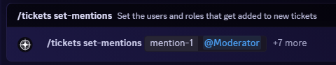
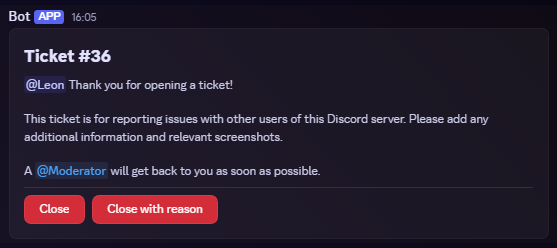
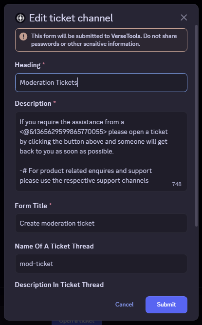
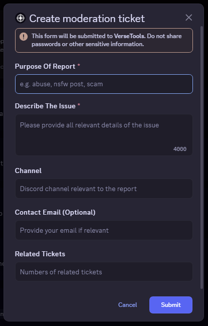

# Usage guide

## Prerequisites

- A discord server
- A discord bot with the [Tickets Plugin](../README.md) installed and added to the server

## Setting up a channel

Let's setup a channel for moderation tickets!

### Initial setup

First, go to the discord channel you would like to use for tickets. Create one like normal if you don't have one already.

Next, run the `/tickets setup` command. You will be presented with the following modal:  

Fill out the available fields and click `Submit` to create the ticket channel. See the diagram below to see what each field corresponds to:  

Great! We've created a basic ticket channel, but we're not done yet! Members can now create tickets by clicking 'Open a ticket' in the ticket message, but we can't see their tickets.

### Adding roles and users to tickets

Still inside the ticket channel, we can use the `/tickets set-mentions` command to add which roles and users are added to newly created tickets.

The command currently supports adding up-to 8 roles or users.

For our example, we'll add the `@moderator` role to the tickets. So all moderators will be able to see the tickets and respond to them:  

Now when a member creates a ticket the `@moderator` role will be mentioned and everyone with that role will be able to see the ticket.

### Basic setup done!

And, that's it! Now members can create tickets and everyone with the `@moderator` role will be able to see them.

For more advanced features such as adding fields to tickets or how to make edits please continue reading.

## Edit a channel

To edit an existing ticket channel you can use the `/tickets edit` command. You will be presented with the modal from the `/tickets setup` command but with the fields filled with the existing channel data:  

> Please note: Changes to ticket thread name and description will only affect newly created tickets.

## Ticket fields

### Add a field to tickets

To add a field to tickets you can use the `/tickets add-field` command which gives you many options to configure the field:  

Once you've added a field, members will now get a prompt to fill out any fields when creating a ticket:  

When the member creates the ticket, their answers to the fields will be displayed in the ticket message:  

You can add up to 5 fields to a ticket channel:  

### Removing fields

To remove a field from a ticket channel it is as simple as using the `/tickets remove-field` command and providing the name of the field you want to remove:  

If you would like to remove all fields from a ticket channel, use the `/tickets remove-all-fields` command.

> Please note: Existing tickets will not be affected.

## Changing per user ticket limit

The per-user ticket limit determines how many new tickets a user can open at once. This defaults to `3` tickets per user.

To change the per-user ticket limit for a channel you can use the `/tickets set-per-user-limit` command:  

## Deleting a channel

To delete a ticket channel you can either delete the discord channel as usual:  

Or if you want to preserve the discord channel but delete the tickets, you can use the `/tickets delete` command. You will get the following prompt to confirm the action:  

Click `Yes, delete this ticket channel` to confirm.
